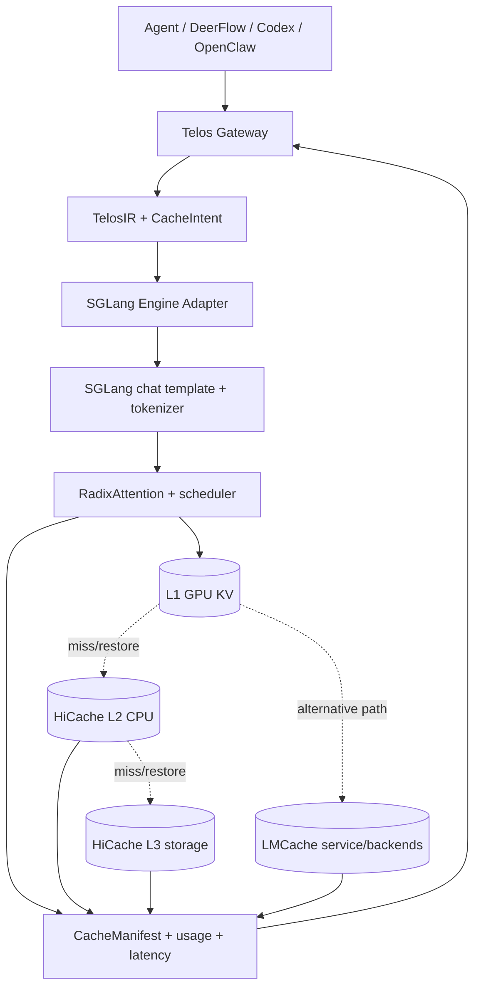
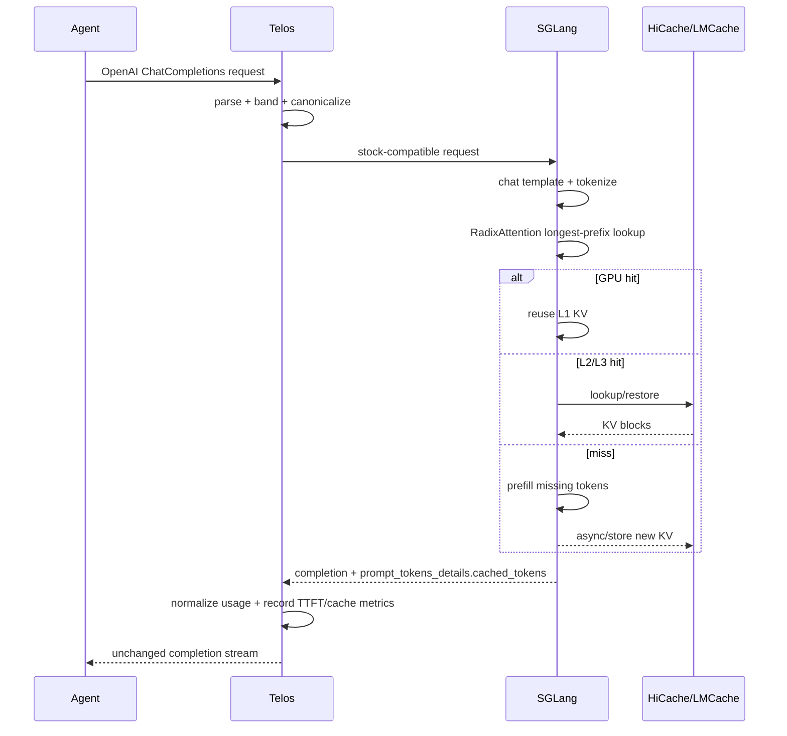

# Telos × SGLang HiCache / LMCache 详细设计

> 状态：Phase 0 完成；Phase 1 代码完成，等待真实 GPU/SGLang A/B 结果
> 日期：2026-08-05
> 范围：`telos-sdk` 本地/自托管推理路径
> 目标读者：Telos、SGLang、推理基础设施与评测工程师

## 0. 决策摘要

本设计把 Telos 定位为 **KV Cache 语义控制面**，把 SGLang 定位为
**token 级缓存执行面**，把 HiCache 或 LMCache 定位为 **KV tensor 数据面**：

```text
Agent / Harness
      │ OpenAI ChatCompletions
      ▼
Telos Gateway
  parse → PIN/FOLD/DROP → canonicalize → CacheIntent
      │ 确定性 wire prompt + 可选缓存意图
      ▼
SGLang
  chat template → tokenizer → RadixAttention → scheduler
      │
      ├── L1: GPU KV blocks
      └── L2/L3（二选一）
            ├── HiCache: CPU + file/Mooncake/3FS/NIXL/AIBrix
            └── LMCache: 独立 KV cache layer
```

采用以下决策：

1. **第一实现目标是 stock-compatible 被动缓存闭环。** Telos 先保证最终 token
   前缀稳定，SGLang 原生 RadixAttention 自动命中，HiCache 扩展容量，Telos 准确采集
   cached tokens 与 TTFT。该阶段不发送任何 stock SGLang 不认识的私有字段。
2. **HiCache 与 LMCache 是替代后端，不同时启用。** 默认先实现 HiCache，因为它是
   SGLang 原生路径、组件少、可最快验证 Telos 的实际收益；LMCache 作为跨 worker、
   多推理引擎和独立缓存服务方向的第二后端。
3. **Telos 不存储、不序列化、不寻址 KV tensor。** 真正的 cache key 必须由 SGLang
   使用最终 model、chat template、tokenizer 与 token ids 生成。
4. **PIN/FOLD/DROP V1 是语义和布局信息，不虚构逐层物理控制。** Stock SGLang
   没有稳定的逐请求 pin、span eviction、fork-and-replace 或 per-span tier API；这些
   能力必须标为 `extension`，不得伪装成 `native`。
5. **主动控制使用单独的 V2 capability-negotiated 协议。** 只有下游明确声明支持时，
   Telos 才发送 `CacheIntent`；token 边界由 SGLang 使用真实 tokenizer 解析并通过
   `CacheManifest` 回传，Telos 不使用字符数猜 token block。
6. **自托管收益以计算与延迟为主。** Dashboard 不复用 Anthropic 的缓存计费公式；
   核心指标改为 avoided prefill tokens、TTFT、restore latency、吞吐与 HBM residency。

## 1. 背景与问题定义

Agent 请求包含大量重复内容：

- tool definitions；
- system prompt、skills、项目规则；
- 已完成的历史对话；
- 大文档或 ref-pool 内容；
- 多 agent 共享的角色说明和工作流模板。

这些内容在每轮都会重新发送。若最终 token 序列具有相同前缀，SGLang 可以复用已经
计算的 KV blocks，只计算新增尾部。现实中存在三个断点：

1. **语义稳定但 wire 不稳定。** JSON key、tools 顺序、动态 envelope 或 chat message
   布局的细微变化会缩短 token 级最长公共前缀。
2. **GPU cache 容量有限。** 即使前缀完全相同，KV blocks 也可能已被 LRU 淘汰；长会话
   和高并发下尤其明显。
3. **上层不知道物理命中。** Telos 当前主要观察云 API usage，尚未把 SGLang 的
   cached-token、cache tier、restore latency 和 prefill latency 连接回 PIN/FOLD/DROP。

本设计分别处理这三个问题：

```text
wire 不稳定       → Telos canonicalization + 单调追加
GPU cache 太小    → HiCache 或 LMCache 分层存储
不可观测/不可控   → CacheIntent + CacheManifest + 新的性能指标
```

## 2. 目标与非目标

### 2.1 目标

- 让 Telos 处理后的多轮 Agent 请求稳定命中 SGLang RadixAttention。
- GPU miss 时从 CPU/L3 恢复 KV，减少重复 Prefill。
- 支持同一 session 的连续复用，以及受安全边界约束的跨 session 共享。
- 明确区分 native、config-only、extension 与 unsupported 能力。
- 对每个请求记录 expected reusable tokens、actual cached tokens、命中层级和净收益。
- 缓存不可用时自动回退为普通 Prefill，不影响正确性。
- 为未来 DeerFlow/KVFlow 的 next-agent 预取和 workflow-aware eviction 保留协议空间。

### 2.2 非目标

- Telos 不直接管理 CUDA/ROCm/NPU 内存。
- Telos 不定义 KV tensor 序列化格式。
- V1 不实现任意非前缀 CacheBlend。
- V1 不承诺逐个 TelosBlock 的物理 pin/unpin。
- 不跨不同模型权重、tokenizer、chat template、LoRA 或不兼容 KV layout 复用。
- 不把 self-hosted cached tokens 直接换算成云 API token 账单节省。
- 不通过改变 prompt 语义或删除必要历史来换取缓存命中。

## 3. 能力现实与支持矩阵

下表是本设计必须遵守的事实边界：

| 能力 | Stock SGLang | SGLang + HiCache | SGLang + LMCache | Telos V2 扩展 |
|---|---|---|---|---|
| 精确公共前缀复用 | native RadixAttention | native | native/connector | 仅提供语义提示 |
| GPU L1 KV cache | native | native | native | 不接管 |
| CPU L2 | 无独立持久层保证 | native HiCache | connector/backend | 可给 retention hint |
| 磁盘/远端 L3 | 否 | 取决于 storage backend | 取决于 LMCache 部署 | 可给 prefetch hint |
| cached token report | `--enable-cache-report` | 同左 | 需版本验证 | 统一解析 |
| session-aware soft protection | native endpoint 可选能力 | 可影响 L1/L2 eviction 顺序 | 需 connector 验证 | adapter 映射前需 contract test |
| per-request namespace | 无稳定公共协议 | 无稳定公共协议 | 需 connector 验证 | extension |
| per-span priority | unsupported | config/scheduler 内部 | backend policy | extension |
| 主动 prefetch | 无公共请求协议 | backend 内部 best effort | backend/controller | extension |
| 显式 span eviction | 无稳定公共协议 | 无稳定公共协议 | 管理面相关能力 | extension |
| fork-and-replace | 无稳定公共协议 | 无稳定公共协议 | 无通用协议 | 不进入 V2 初版 |
| 跨 worker 共享 | 依赖路由局部性 | 取决于 L3 backend | 目标能力，需固定版本验证 | namespace/route hint |

特别约束：

- `--enable-lmcache` 在 SGLang 中被定义为 alternative hierarchical cache solution，
  不和 `--enable-hierarchical-cache` 同时使用。
- `lock_radix_path`、`prefer_tier`、`fork_from_path`、`replace_suffix`、
  `evict_span`、`prewarm_only` 不是本设计依赖的 stock SGLang 公共 wire contract。
- LMCache 的 vLLM MP 路径与 SGLang 路径成熟度并不相同；SGLang 接入必须维护经过验证的
  model × SGLang × LMCache × hardware 版本矩阵。

## 4. 总体架构

### 4.1 控制面、执行面、数据面



职责边界：

| 组件 | 必须负责 | 明确不负责 |
|---|---|---|
| Telos | 内容分带、稳定排序、session/workflow 语义、安全 scope、观测关联 | tokenization、tensor IO、GPU allocation |
| SGLang adapter | 生成合法 wire、能力协商、usage 归一化、扩展协议翻译 | 自己估算实际 KV 是否存在 |
| SGLang | 最终 tokenization、radix 匹配、调度、Prefill/Decode | 理解业务敏感性和 Agent 工作流 |
| HiCache/LMCache | KV 存取、层级迁移、容量和后端实现 | 修改 prompt 或决定业务共享边界 |

### 4.2 两个部署拓扑

#### 拓扑 H：SGLang + HiCache（默认）

```text
Telos → SGLang worker
             ├── RadixAttention / GPU L1
             ├── HiCache CPU L2
             └── HiCache L3 backend
```

适用场景：

- 单一 SGLang 技术栈；
- 单机或同构集群；
- 希望最少组件验证 Telos 收益；
- CPU RAM 足够，L3 可选。

#### 拓扑 L：SGLang + LMCache（替代）

```text
Telos → SGLang worker(s) → LMCache connector/service → CPU/Disk/Remote
```

适用场景：

- 多 worker 之间共享 KV；
- 希望缓存服务与推理进程独立生命周期；
- 同时规划 vLLM/SGLang；
- 需要独立管理、迁移、容量和观测接口。

## 5. 核心领域模型

### 5.1 逻辑缓存区域

| Band | 典型内容 | V1 行为 | V2 意图 |
|---|---|---|---|
| PIN | tools、system、skills、项目规则 | 固定在 prompt 最前，最大化公共前缀 | `hot`、高优先级、较长预期复用 |
| FOLD | 历史、tool result、大文档 | 单调追加，允许 compact 后从分叉点重算 | `warm`，可进入 CPU/L3 |
| DROP | timestamp、cwd、git 状态、envelope | 移到尾部，避免破坏前缀 | `drop`/不主动保留 |

“DROP 不进入 cache hash”在不同引擎上不能做字面承诺。Stock RadixAttention 仍可能缓存
完整 token block；Telos 能保证的是 **DROP 变化不破坏它之前的稳定前缀**。只有 V2
扩展成功映射到物理 radix 节点后，才可能表达“不保留 DROP 尾部”。

### 5.2 CacheIntent

`CacheIntent` 是 engine-agnostic、advisory 的控制面对象，建议作为 `TelosIR` 的可选字段，
而不是塞入 `TelosHints.extra`：

```python
from dataclasses import dataclass
from typing import Literal

ReuseScope = Literal["request", "session", "project", "tenant"]
RetentionClass = Literal["hot", "warm", "cold", "drop"]
Sensitivity = Literal["private", "project", "tenant"]

@dataclass(frozen=True)
class LogicalPosition:
    segment: Literal["tools", "system", "message"]
    index: int
    message_index: int | None = None

@dataclass(frozen=True)
class CacheBoundary:
    name: str
    end: LogicalPosition
    band: Literal["pin", "fold", "drop"]
    retention: RetentionClass
    expected_reuses: int = 0

@dataclass(frozen=True)
class CacheIntent:
    schema_version: int
    namespace: str                 # opaque，不能包含用户明文
    reuse_scope: ReuseScope
    sensitivity: Sensitivity
    boundaries: tuple[CacheBoundary, ...]
    next_use_distance: int | None = None
    branch_parent: str | None = None
```

约束：

- `namespace` 是安全隔离输入，不是 session id。
- `boundary` 是逻辑位置，不能携带客户端猜测的 token index。
- `next_use_distance` 只是调度提示；未知时为 `None`。
- `branch_parent` 只表达工作流关系，不改变实际 token cache key。
- 原始用户不能直接提交可信 `CacheIntent`；Gateway 必须先删除外部同名字段，再自行生成。

### 5.3 CacheRuntimeIdentity

真正允许复用的物理 namespace 由 SGLang/connector 生成：

```text
runtime_namespace = H(
    security_namespace,
    model_weight_revision,
    tokenizer_revision,
    chat_template_digest,
    rope/attention_config,
    lora_or_adapter_digest,
    kv_dtype_and_layout,
    engine_compatibility_epoch
)
```

其中任何一项变化都必须自然 miss 或显式 invalidation。不得只使用 `model` 字符串。

### 5.4 CacheManifest

V2 patched SGLang 可在响应 usage 扩展或独立 telemetry 中返回：

```json
{
  "schema": "telos.cache-manifest/v1",
  "request_id": "req_...",
  "runtime_namespace": "sha256:...",
  "prompt_tokens": 26000,
  "matched_tokens": 24000,
  "computed_tokens": 2000,
  "hit_tier_tokens": {
    "gpu": 16000,
    "cpu": 8000,
    "l3": 0
  },
  "restore": {
    "bytes": 268435456,
    "latency_ms": 18.7,
    "timed_out": false
  },
  "boundaries": [
    {
      "name": "pin_end",
      "token_end": 12032,
      "path_id": "opaque:...",
      "state": "gpu"
    }
  ]
}
```

`path_id` 必须是 opaque handle，不能暴露 raw token ids 或底层 tensor 地址。

## 6. 请求生命周期

### 6.1 V1：stock-compatible 被动缓存



V1 中 Telos 的实际价值来自：

1. tools 和 schema canonicalization；
2. system、tools 与 messages 的稳定物理顺序；
3. 把动态内容沉到尾部；
4. 同一会话单调追加；
5. 通过同一模型与 chat template 发给同一 SGLang cache domain。

### 6.2 V2：能力协商与主动提示

Telos 首次连接 upstream 时调用：

```http
GET /v1/telos/capabilities
```

期望响应：

```json
{
  "schema": "telos.cache-capabilities/v1",
  "intent_versions": [1],
  "features": {
    "request_namespace": "extension",
    "cache_manifest": "extension",
    "boundary_resolution": "extension",
    "retention_hint": "extension",
    "prefetch_hint": "extension",
    "explicit_evict": "unsupported"
  }
}
```

规则：

- 404、超时、格式错误或版本不兼容都降级为 stock mode。
- capability 结果按 upstream URL + engine build 缓存，设置短 TTL。
- 未协商成功时绝不发送 `telos_cache` 字段，避免 stock server 400。
- capabilities 只声明支持，不代表 cache 当前可用；运行时仍需 fail-open。

协商成功后，可在请求中附加：

```json
{
  "telos_cache": {
    "schema": "telos.cache-intent/v1",
    "namespace": "opaque:tenant/project",
    "reuse_scope": "project",
    "sensitivity": "project",
    "boundaries": [
      {
        "name": "pin_end",
        "logical_end": {"segment": "system", "index": 2},
        "retention": "hot",
        "expected_reuses": 12
      }
    ],
    "next_use_distance": 2,
    "branch_parent": "opaque:branch-a"
  }
}
```

patched SGLang 的 tokenizer manager 在应用真实 chat template 后解析逻辑边界，并把边界
映射到安全的 radix node；无法无歧义解析的边界必须忽略并报告 warning，不能使用
Telos 的字符数近似值。

### 6.3 Fold 与分支

Fold 不等于“旧 suffix 的 KV 可以直接变成 summary KV”。正确语义是：

```text
旧路径：prefix ─ old history suffix
新路径：prefix ─ compact summary suffix
                 ↑ 这里仍需重新 Prefill
```

可以复用的只有分叉点之前完全相同的 token prefix。V1 依赖 RadixAttention 自然完成；
V2 可以用 `branch_parent` 和 manifest path 做调度提示，但不宣称零计算替换 suffix。

## 7. Cache key、session 与安全 scope

### 7.1 三个标识必须分离

| 标识 | 含义 | 生命周期 |
|---|---|---|
| `session_id` | 一段对话和 BridgeSessionState | conversation |
| `reuse_scope` | 哪类请求有资格共享 | request/session/project/tenant |
| `runtime_namespace` | 物理 KV 兼容与安全域 | model/runtime deployment |

推荐默认：

```text
tools + public system template  → project scope
对话历史                        → session scope
用户私有文档                    → session 或 user-private scope
公共模型说明                    → tenant scope（仅单租户内部）
```

### 7.2 Stock mode 的多租户限制

若 stock SGLang/HiCache 无法提供请求级 namespace 隔离，则只能选择：

1. 一个租户/安全域一个 SGLang deployment；或
2. 禁止跨 session 共享敏感内容；或
3. 等待/启用经过审计的 namespace extension。

不能只依赖 Telos session id，因为 RadixAttention 是按实际 token 前缀匹配，跨请求命中可能
形成 timing side channel。

### 7.3 Cache poisoning 防护

- Gateway 删除用户提交的 `telos_cache`、`cache_policy` 等内部字段。
- namespace 由服务端认证上下文生成，不接受 prompt 中的 tenant id。
- remote cache entry 绑定完整 runtime identity。
- 存储层校验 tensor metadata、层数、shape、dtype 与 checksum。
- 不兼容或损坏 entry 必须按 miss 处理，不能带病注入模型。

## 8. Telos 代码改造

### 8.1 `ir.py`

1. 扩展 `TelosHints.engine` 的类型，纳入 `vllm` 和 `sglang`；当前 Literal 与实际 registry
   支持范围不一致。
2. 新增 engine-agnostic `LogicalPosition`、`CacheBoundary`、`CacheIntent`。
3. 在 `TelosIR` 中增加 `cache_intent: CacheIntent | None = None`。
4. 新增 invariant：
   - boundary 必须指向存在的 block；
   - PIN boundary 不能落在 DROP 之后；
   - namespace 不得为空或包含用户明文；
   - `expected_reuses >= 0`；
   - `next_use_distance` 为 `None` 或非负整数。

### 8.2 `engine/base.py`

当前一组 bool 会把“设计中能力”和“真实公共 API”混在一起。增加显式等级：

```python
FeatureSupport = Literal["unsupported", "native", "config_only", "extension", "emulated"]

@dataclass(frozen=True)
class CacheCapabilities:
    prefix_reuse: FeatureSupport = "unsupported"
    cache_report: FeatureSupport = "unsupported"
    hierarchical_storage: FeatureSupport = "unsupported"
    request_namespace: FeatureSupport = "unsupported"
    cache_manifest: FeatureSupport = "unsupported"
    boundary_resolution: FeatureSupport = "unsupported"
    retention_hint: FeatureSupport = "unsupported"
    prefetch_hint: FeatureSupport = "unsupported"
    explicit_evict: FeatureSupport = "unsupported"
```

旧字段可先保留并标为 deprecated，避免一次性破坏插件；但 stock SGLang 不得再声明不存在的
`span_eviction=True`、`fork_and_replace=True`、`pin_unpin=True`。

新增协议感知 emission：

```python
def emit_for_protocol(
    self,
    ir: TelosIR,
    plan: EmitPlan,
    protocol: Literal["anthropic-messages", "openai-chat", "openai-responses"],
) -> Mapping[str, Any]: ...
```

这样 OpenAI ChatCompletions 不必绕过 adapter。

### 8.3 `engine/sglang.py`

拆成两个 mode：

```text
stock      只发 SGLang/OpenAI 兼容字段
extension  capability negotiation 成功后才发 telos_cache
```

必须改动：

- `emit_for_protocol(..., "openai-chat")` 生成最终 ChatCompletions body；
- stock mode 删除当前非标准 `cache_control` 输出；
- extension mode 只输出协商过的字段；
- `parse_usage` 优先读取：

```python
usage["prompt_tokens_details"]["cached_tokens"]
```

- 为兼容旧 mock/版本，可回退读取 `usage["cached_tokens"]`；
- `raw_input = max(0, prompt_tokens - cached_tokens)`；
- stock SGLang 无独立 cache-write usage 时保持 `cache_write=0`，但不能把它解释为“没有写
  KV”；它只表示“API 没有可归一化的 write bucket”。
- 配置显式开启 tier telemetry 时，请求增加公开字段
  `return_cached_tokens_details=true`；响应解析
  `sglext.cached_tokens_details.{device,host,storage,storage_backend}`，并归一化为
  `gpu/cpu/l3`。字段缺失或格式异常时返回 unknown，不能根据 aggregate cached tokens
  反推物理层级。
- extension manifest 保存在 `UsageReport.raw`，并提取更细的 restore telemetry（V2）。

### 8.4 `proxy/pipeline.py`

当前 OpenAI 路径执行：

```python
plan = bridge.mark()
ir2 = _canonicalize_ir(...)
wire = _ir_to_chat_completions(ir2, model=model)
```

这会绕过 `engine.emit()`，导致 SGLang 的 routing/cache plan 不进入真正 wire。改为：

```python
plan = bridge.mark()
ir2 = _canonicalize_ir(bridge.snapshot_ir())
wire = engine.emit_for_protocol(ir2, plan, protocol="openai-chat")
```

然后再合并 sampling passthrough 字段。合并时应阻止调用者覆盖由 Telos 生成的内部字段。

### 8.5 `proxy/server.py`

增加：

- upstream capability cache；
- 删除外部请求中的保留字段；
- 记录 request start、upstream first byte、first token、completion time；
- 对 streaming 与 non-streaming 都抽取 SGLang nested usage；
- 将 `CacheManifest` 和 engine build/version 放入 usage log；
- cache 层失败不触发重复业务请求，只让 SGLang 内部回退 Prefill；
- capability probe 可以安全重试，completion 请求仍遵循现有避免重复执行的策略。

### 8.6 `config.py`

为 upstream 增加可选配置，保持旧配置兼容：

```json
{
  "url": "http://127.0.0.1:30000",
  "engine": "sglang",
  "protocol": "openai-chat",
  "cache": {
    "mode": "stock",
    "backend": "hicache",
    "tier_telemetry": true,
    "security_namespace": "local-dev",
    "allow_cross_session": false,
    "capability_ttl_seconds": 60
  }
}
```

`mode`：

- `off`：不发送 cache telemetry opt-in，只保留 prompt 稳定化；
- `stock`：只使用 stock server 的公开接口，永不发送私有 extension。

`backend` 是部署事实标签：`auto`、`radix`、`hicache` 或 `lmcache`；它不切换 SGLang
后端，只让日志和实验切片知道请求对应哪种部署。`tier_telemetry=true` 只对声明支持
该公开字段的 adapter 注入遥测请求；旧版 SGLang 没有返回 `sglext` 时 fail-open。
`auto/extension` capability negotiation 留在 Phase 4，V1 配置加载器不会接受或发送它们。

### 8.7 Dashboard 与 usage log

新增 self-hosted performance 视角，不套用云 API 价格：

```json
{
  "cache_runtime": {
    "backend": "hicache",
    "prompt_tokens": 26000,
    "expected_reusable_tokens": 24000,
    "cached_tokens": 24000,
    "computed_prefill_tokens": 2000,
    "hit_tier_tokens": {"gpu": 16000, "cpu": 8000, "l3": 0},
    "restored_tokens": 8000,
    "storage_backend": null
  }
}
```

上述 V1 在线字段来自 SGLang 响应本身。`restore_bytes`、`restore_ms`、`ttft_ms` 需要
服务端 manifest/metrics 或流式时间戳，当前实现不伪造这些数值。

核心指标：

```text
physical_hit_ratio       = cached_tokens / prompt_tokens
cache_effectiveness      = cached_tokens / expected_reusable_tokens
avoidable_miss_tokens    = max(0, expected_reusable_tokens - cached_tokens)
computed_prefill_tokens  = prompt_tokens - cached_tokens
restore_net_ms           = estimated_recompute_ms - restore_ms
```

V1 在线链路没有精确 semantic-boundary token manifest 时，字段应命名为
`expected_reusable_tokens_estimate`，并允许为 `null`。只有以下两种情况才能使用不带
`estimate` 的精确字段：

1. benchmark generator 使用与服务端一致的 pinned tokenizer/chat template 计算；或
2. V2 SGLang 返回经过服务端 tokenization 的 `CacheManifest`。

`estimated_recompute_ms` 只能由同模型、同硬件、相近长度的 Prefill profile 估算，并明确
标注为 estimate。

## 9. 部署配置

### 9.1 Baseline：SGLang RadixAttention

RadixAttention 默认启用；不要传 `--disable-radix-cache`：

```bash
python -m sglang.launch_server \
  --model-path <MODEL> \
  --host 0.0.0.0 \
  --port 30000 \
  --enable-cache-report \
  --enable-metrics
```

Telos upstream：

```json
{
  "upstreams": {
    "local-sglang": {
      "url": "http://127.0.0.1:30000",
      "engine": "sglang",
      "protocol": "openai-chat",
      "via": "codex",
      "cache": {
        "mode": "stock",
        "backend": "radix",
        "tier_telemetry": false,
        "security_namespace": "local-dev",
        "allow_cross_session": false
      }
    }
  }
}
```

仓库已内置 `local-sglang` upstream。启动 Telos gateway 后可执行真实 A/B：

```bash
python -m telos.scripts.benchmark_sglang_cache \
  --model <MODEL> \
  --direct-url http://127.0.0.1:30000/v1/chat/completions \
  --telos-url http://127.0.0.1:7171/upstreams/local-sglang/v1/chat/completions \
  --flush-url http://127.0.0.1:30000/flush_cache \
  --rounds 4 \
  --output /tmp/telos-sglang-cache-ab.json
```

脚本把第一轮当作 cache fill，统计后续轮次的 cached tokens、computed prefill、命中率、
first-event、first-token 与 E2E。`--flush-url` 会在 direct/Telos 两组之间清空 cache，
避免交叉污染；生产 server 若禁用了该管理端点，可省略但需分开重启/预热实例。

### 9.2 HiCache L2

仓库提供了可审计的启动模板与 Telos 配置样例：

```bash
cp deploy/sglang/hicache.env.example /tmp/telos-hicache.env
# 编辑 MODEL_PATH 等参数，然后：
set -a
source /tmp/telos-hicache.env
set +a
deploy/sglang/launch_hicache.sh
```

`deploy/sglang/telos-config.example.json` 中的 upstream 打开
`backend=hicache` 与 `tier_telemetry=true`。等价的底层启动参数是：

```bash
python -m sglang.launch_server \
  --model-path <MODEL> \
  --host 0.0.0.0 \
  --port 30000 \
  --enable-hierarchical-cache \
  --hicache-ratio 2 \
  --hicache-write-policy write_through \
  --hicache-io-backend kernel \
  --enable-cache-report \
  --enable-metrics
```

说明：

- `hicache-ratio` 是 host KV pool 相对 device pool 的比例；必须结合每 rank RAM 验证。
- `write_through` 优先保证下一次 GPU miss 后能从 L2 恢复；之后根据 IO 压力比较
  `write_back`。
- 不先给出通用固定 GB，因为模型 KV layout、TP、KV dtype 和显存池大小差异很大。

启动完成后执行 L1 淘汰 → L2 恢复契约：

```bash
python -m telos.scripts.contract_sglang_hicache \
  --model <MODEL> \
  --url http://127.0.0.1:30000/v1/chat/completions \
  --flush-url http://127.0.0.1:30000/flush_cache \
  --prefix-chars 64000 \
  --pressure-rounds 16 \
  --expected-tier host \
  --output /tmp/telos-hicache-contract.json
```

测试先预热目标前缀，再用从首 token 起就不同的长 prompt 施加 KV 压力，最后精确重放
目标。默认验收要求 aggregate cached ratio ≥ 0.8 且 `host > 0`。若 L1 仍未淘汰，增大
`--pressure-rounds`/`--prefix-chars`；若管理端点启用了 admin key，补充
`--admin-api-key`。`--no-assert` 仅用于采集诊断，不能作为验收通过。

### 9.3 HiCache L3

在 L2 验证通过后增加：

```bash
--hicache-storage-backend file
```

`file` 只用于功能验证。生产根据硬件选择 Mooncake、3FS、NIXL、AIBrix 或经过验证的
dynamic backend，并显式配置：

- 存储容量和 eviction；
- prefetch policy；
- restore timeout；
- RDMA/NUMA 亲和；
- cache identity/version；
- telemetry 与故障注入。

### 9.4 LMCache 替代路径

不要同时启用 `--enable-hierarchical-cache`：

```bash
python -m sglang.launch_server \
  --model-path <MODEL> \
  --host 0.0.0.0 \
  --port 30000 \
  --enable-lmcache \
  --lmcache-config-file <PINNED_VERSION_CONFIG.yaml> \
  --enable-cache-report \
  --enable-metrics
```

LMCache YAML schema 随版本与 connector mode 演进，本仓库不复制一份可能过期的通用
配置。部署清单必须记录：

```text
SGLang commit/version
LMCache commit/version
connector mode
model revision
tokenizer/chat template revision
GPU/CPU/NIC/storage
验证过的配置文件 digest
```

## 10. 缓存策略

### 10.1 V1 策略

V1 不主动操纵具体 cache node，仅通过结构提高自然命中：

1. tools 全部 PIN 且确定性排序；
2. system 中稳定内容优先；
3. ref-pool slug 与内容版本稳定；
4. 历史消息单调追加；
5. DROP 永远沉到尾部；
6. 不在每轮头部注入 request id、timestamp、cwd；
7. 同一实验固定 model、chat template 和 tokenizer；
8. 多 worker 时启用 cache-aware routing 或共享 L3，不能随机漂移后仍期待 L1 命中。

SGLang 另有 session-aware radix cache，可让活跃 session 引用的 KV 在内存压力下晚于
未引用 KV 被淘汰。它是 **soft protection，不是物理 pin，也不是安全 namespace**。
当前官方示例使用 native `/generate` 请求的顶层 `session_id`；Telos 在把它接入
OpenAI ChatCompletions adapter 前，必须先用 pinned SGLang 做协议 contract test，不能假设
未知字段会被兼容端点接受。

### 10.2 V2 retention 策略

推荐初始映射：

| 条件 | Retention | 说明 |
|---|---|---|
| PIN 且 `expected_reuses >= 3` | hot | 优先留在 GPU/L2 |
| PIN 但下一次使用较远 | warm | 可下沉 CPU |
| FOLD 且会在 1–3 step 内使用 | warm | 允许预取 |
| FOLD 且已 compact | cold/evict old branch | 仅在 manifest 确认无活跃引用后 |
| DROP | drop | 不主动写远端层 |

所有阈值必须由 workload profile 决定，而不是写死在通用 Bridge 中。

### 10.3 Restore 还是重算

调度器应比较：

```text
restore_cost(prefix, tier) < recompute_cost(prefix, current_load)
```

短前缀、慢磁盘或网络拥塞时，恢复可能比 Prefill 更慢。V2 可加入：

```text
min_restore_tokens
restore_deadline_ms
best_effort | wait_complete | recompute
```

默认 fail-open：超过 deadline 就重算，不阻塞整个 scheduler。

### 10.4 Workflow-aware prefetch

未来 DeerFlow/KVFlow 提供 `next_use_distance`：

```text
distance = 0  当前 step，需要 L1
distance = 1  下一个 step，开始 L2/L3 → L1 预取
distance = 2  保留 L2，必要时后台预取
distance > N  可下沉或淘汰
```

Telos 只传递 workflow hint；SGLang scheduler 结合队列、显存和 IO 带宽做最终决定。

## 11. 失败与降级语义

| 故障 | 行为 | 正确性要求 |
|---|---|---|
| capability endpoint 不存在 | stock mode | 请求不受影响 |
| HiCache/LMCache lookup miss | 正常 Prefill | 输出语义不变 |
| L2/L3 restore timeout | 放弃恢复并重算 | 不返回半注入状态 |
| entry metadata 不兼容 | 当作 miss，并计 invalidation | 禁止强行加载 |
| cache backend 暂时不可用 | 熔断一段时间，继续推理 | 推理服务可用 |
| manifest 缺失 | 记录 unknown，不推断 tier | 不影响响应 |
| Telos rewrite 失败 | 沿用现有 passthrough | 不阻断 agent |
| streaming telemetry 解析失败 | 保留原 SSE，usage 标 unknown | 不能破坏流 |

缓存层故障不应由 Telos 重试 completion 请求。请求可能已被模型执行，重复发送会导致重复
计费、重复工具动作或不同输出。

## 12. 测试设计

### 12.1 单元测试

新增或修改：

- `tests/test_cache_intent.py`
  - namespace/scope/boundary invariant；
  - 外部保留字段剥离；
  - intent 序列化稳定性。
- `tests/test_engine_sglang.py`
  - stock wire 不含 private cache fields；
  - extension 只在协商成功后发送；
  - nested 与 legacy cached-token usage 兼容；
  - manifest 解析。
- `tests/test_proxy_openai_route.py`
  - `engine="sglang"` 实际通过 adapter emission；
  - sampling 字段仍透传；
  - streaming/non-streaming usage 一致。
- `tests/test_config.py`
  - cache config round-trip；
  - 老配置默认 stock/auto 行为兼容。
- `tests/test_smoke.py`
  - 删除把非标准 `cache_control` 当成 stock 能力的断言；
  - capability level 与真实实现一致。

### 12.2 Contract 测试

使用真实 SGLang pinned image，而不是只测 mock：

1. `/health` 与 `/v1/models`；
2. 同一请求两次，第二次 `cached_tokens > 0`；
3. 改变最后 user tail，稳定前缀仍命中；
4. 改变 system 第一个 token，预期大幅 miss；
5. 开启 HiCache 后制造 L1 eviction，验证 L2 restore；
6. cache backend 停止时仍能完成请求；
7. 切换 model/template revision 后不得命中旧 KV；
8. 多租户 namespace 测试不得跨域命中。

### 12.3 正确性测试

- temperature=0、相同 seed、相同 batching 条件下对比输出；
- 不只比较文本，还比较 tool call name、arguments schema 与 finish reason；
- 对可能存在 GPU 非确定性的模型，比较任务轨迹与结构化结果，不把 byte-identical 输出
  作为唯一标准；
- 任意 cache miss/hit/restore 路径都不得改变输入 token 序列。

## 13. Benchmark 设计

### 13.1 对照组

| 组 | Telos | RadixAttention | L2/L3 |
|---|---:|---:|---|
| A | off | on | off |
| B | on | on | off |
| C | on | on | HiCache L2 |
| D | on | on | HiCache L2+L3 |
| E | on | on | LMCache |

另设 `RadixAttention off` 仅用于测纯 Prefill 上界，不作为生产基线。

### 13.2 Workload

- 稳定 system/tools：8K、32K、64K tokens；
- 每轮新增：512、2K、8K tokens；
- turn 数：2、6、20；
- 并发：1、16、64；
- tool schema key/order jitter；
- timestamp/cwd DROP jitter；
- tool result 大小：小、中、爆炸型；
- 单 worker sticky session；
- 多 worker session migration；
- branch/fold；
- cache pressure：工作集为 L1 容量的 0.5×、1×、2×、5×。

### 13.3 指标

- TTFT p50/p95/p99；
- E2E latency、TPOT、ITL；
- request/input/output throughput；
- actual cached tokens；
- expected reusable tokens；
- L1/L2/L3 hit tokens；
- restore bytes、restore latency、restore timeout；
- computed Prefill tokens 与 Prefill GPU time；
- GPU KV utilization、CPU/L3 footprint；
- eviction regret：被淘汰后很快又恢复/重算的 token 数；
- error/timeout/fallback rate。

### 13.4 示例收益模型

初始稳定前缀 12K、每轮新增 4K、共 6 轮：

```text
无复用 Prefill = 12 + 16 + 20 + 24 + 28 + 32 = 132K tokens
理想增量 Prefill = 12 + 4 + 4 + 4 + 4 + 4  = 32K tokens
避免 Prefill     = 100K tokens，约 75.8%
```

这只是 token 工作量上界；净延迟收益还要扣除 KV lookup、CPU/GPU copy、L3 IO 和调度等待。

## 14. 验收标准

### 14.1 V1 必须满足

- SGLang stock server 接收的请求中没有非标准 `cache_control` 字段。
- OpenAI ChatCompletions 路径不再绕过 SGLang adapter。
- `--enable-cache-report` 的 nested cached tokens 被正确归一化。
- 受控 16K+ 稳定前缀 workload 中，由 benchmark 的 pinned tokenizer 计算期望前缀，
  第二轮实际 cached tokens 至少覆盖该值的 90%（允许 block/chat-template 边界损耗）。
- Telos on 相比 Telos off 的 expected reusable prefix 不降低。
- cache backend 关闭后请求仍成功完成。
- 自托管 dashboard 不显示未经配置的云 API 美元节省。

### 14.2 HiCache 必须满足

- 人为制造 L1 eviction 后可以观测 L2/L3 restore，而不是全量 Prefill。
- 16K+ 前缀的 p95 TTFT 相对无分层恢复基线有正收益。
- 短前缀 workload p95 回退目标不超过 5%；超过则启用 restore threshold。
- 无 corruption、跨 model 或跨 namespace 命中。

### 14.3 LMCache 进入 production 候选的条件

- pinned 版本矩阵完成；
- 单 worker 与多 worker contract tests 通过；
- cache service 重启、worker 重启、网络抖动故障注入通过；
- 相对 HiCache 在目标 workload 上有明确的跨 worker 命中或运维收益；
- SGLang connector 的观测字段足以解释 miss/restore，而不是黑盒。

## 15. 分阶段实施

### Phase 0：能力诚实化

- [x] 修正 capability matrix；
- [x] stock/extension 分离；
- [x] 删除或隔离伪公共 wire 字段；
- [x] 更新 smoke tests。

交付：默认行为改为 stock-compatible，文档、代码声明与真实 API 一致。

### Phase 1：Stock SGLang 被动闭环

- [x] 修复 OpenAI adapter emission；
- [x] 正确解析 cached tokens；
- [x] 增加 SGLang upstream preset/config；
- [x] 增加 performance usage schema；
- [x] 落地可重复 A/B benchmark runner；
- [ ] 在目标 GPU、模型与 pinned SGLang 版本上跑 A/B 并归档结果。

交付：证明 Telos 带来的 prefix stability 能转化为真实 cached tokens 和 TTFT 收益。

### Phase 2：HiCache

- [x] 落盘 stock SGLang + HiCache L2 启动模板；
- [x] 增加 `backend=hicache` / `tier_telemetry` 配置与旧配置兼容；
- [x] 接入 streaming/non-streaming tier telemetry；
- [x] 落盘 L1 eviction → L2/L3 restore 契约 runner 与纯单测；
- [ ] 在目标 GPU、模型与 pinned SGLang 版本上执行 contract 并归档原始 JSON；
- [ ] L2 验证后选择并压测 L3 backend；
- [ ] 用同硬件 Prefill 基线验证 p95 TTFT 净收益。

交付：长会话在 GPU eviction 后仍能低成本恢复。

### Phase 3：LMCache 实验路径

- pinned connector；
- 单 worker → 多 worker；
- 与 HiCache 相同 workload 对比；
- 只在有明确收益时进入推荐矩阵。

交付：跨 worker 或统一缓存服务能力。

### Phase 4：CacheIntent / CacheManifest V2

- capability endpoint；
- namespace；
- server-side boundary resolution；
- retention/prefetch hints；
- fail-open 与安全审计。

交付：Telos 从“让缓存自然命中”升级为“语义驱动缓存策略”。

### Phase 5：Workflow-aware cache

- DeerFlow/KVFlow next-use-distance；
- branch-aware prefetch；
- eviction regret 优化；
- 根据线上 trace 调参。

交付：Agent workflow-aware KV scheduler。

## 16. 风险与待决策项

1. **SGLang extension 是否 upstream。** 优先尝试通用 capability/manifest 设计，避免维护
   长期 fork；若必须 fork，字段必须放在独立 namespace 并有版本握手。
2. **边界粒度。** V2 初版建议只支持 tools/system/message 安全边界；message 内 block
   精确 token 边界后置，避免 chat template/tokenizer 歧义。
3. **LMCache SGLang MP 成熟度。** 在版本矩阵完成前保持 experimental。
4. **Hybrid attention/Mamba/VLM。** KV groups、state cache 和 multimodal encoder cache
   可能不是统一 block geometry，必须逐模型验证。
5. **多租户 namespace。** 若 stock runtime 无隔离能力，必须用部署隔离代替逻辑约定。
6. **缓存与推理确定性。** KV 复用理论上不改变语义，但不同 kernel、dtype、batching 和
   speculative decoding 组合仍需回归。
7. **KTransformers。** 后续优先通过 SGLang 集成，而不是新增独立 legacy server 协议；
   它属于执行后端，不改变本设计三层边界。

## 17. 参考资料

- SGLang server arguments（`--enable-cache-report`、HiCache、LMCache）：
  <https://github.com/sgl-project/sglang/blob/main/docs/advanced_features/server_arguments.md>
- SGLang HiCache：<https://docs.sglang.io/docs/advanced_features/hicache_design>
- SGLang session-aware radix cache：
  <https://docs.sglang.io/docs/advanced_features/session_radix_cache>
- SGLang Model Gateway cache-aware routing：
  <https://github.com/sgl-project/sglang/blob/main/docs/advanced_features/sgl_model_gateway.md>
- SGLang OpenAI protocol（`return_cached_tokens_details`、`CachedTokensDetails`）：
  <https://github.com/sgl-project/sglang/blob/main/python/sglang/srt/entrypoints/openai/protocol.py>
- LMCache integration：<https://docs.lmcache.ai/developer_guide/integration.html>
- LMCache quickstart：<https://docs.lmcache.ai/getting_started/quickstart.html>
- LMCache repository：<https://github.com/LMCache/LMCache>
- Telos 当前总体架构：[ARCHITECTURE.md](ARCHITECTURE.md)

## 18. 最终边界

本设计完成后，Telos 的承诺应表述为：

> Telos 生成 cache-friendly、可观测、可携带语义意图的推理请求；SGLang 使用真实 token
> 前缀执行 KV 复用；HiCache 或 LMCache 扩展 KV 的存储层级和跨请求生命周期。

不应表述为：

> Telos 自己保存 KV，或 stock SGLang 已经支持 Telos 的逐 span pin/evict/fork 私有协议。

这条边界保证 Telos 可以同时支持闭源 prompt caching 与开源 KV infrastructure，又不会
把自身耦合成另一套推理引擎。
